<div align="center">



# 🔴 RedisAgent

### *Conversational AI Agent for Redis Data Management*

[](https://python.org)
[](https://fastapi.tiangolo.com)
[](https://google.github.io/adk-docs/)
[](https://modelcontextprotocol.io)
[](https://redis.io)
[](https://streamlit.io)
[](https://deepmind.google/technologies/gemini/)
[](https://github.com/hiborn4/RedisAgent/actions)

> **Ask questions in plain English. Get answers from Redis.**  
> RedisAgent combines Google's Agent Development Kit, the Model Context Protocol, and Gemini 2.5 Pro into a fully agentic pipeline — no SQL, no scripts, just a chat box.

---

[**Live Demo**](#-demo) · [**Architecture**](#-architecture) · [**Quick Start**](#-quick-start) · [**API Reference**](#-api-reference) · [**Landing Page**](https://hiborn4.github.io/RedisAgent/)

</div>

---

## 📸 Screenshots

<table>
  <tr>
    <td width="50%">
      
      <p align="center"><i>Conversational chat interface with dark theme</i></p>
    </td>
    <td width="50%">
      
      <p align="center"><i>Agent reasoning over Redis keys in real time</i></p>
    </td>
  </tr>
  <tr>
    <td width="50%">
      
      <p align="center"><i>Live backend health — ADK, MCP, Redis status</i></p>
    </td>
    <td width="50%">
      
      <p align="center"><i>Key listing and pattern search via natural language</i></p>
    </td>
  </tr>
</table>

> 📹 **Demo video** → [`docs/demo.mp4`](docs/demo.mp4)  
> *(See [Screenshots & Recording Guide](#-screenshots--recording-guide) for capture instructions)*

---

## 🧠 What Is This?

RedisAgent is an **agentic AI system** that wraps Redis behind a natural language interface. Instead of writing `redis-cli` commands, you chat with a Gemini-powered agent that:

1. **Discovers** available keys via `list_keys` and `search_keys` MCP tools
2. **Fetches** values with `get_key` and automatically **parses nested JSON**
3. **Reasons** across multiple key-value pairs to answer complex questions
4. **Persists** multi-turn session state via SQLite-backed ADK sessions

The project is a showcase of the **Google Agent Development Kit (ADK)** + **Model Context Protocol (MCP)** integration — a modern agentic pattern where the LLM drives tool selection rather than hardcoded logic.

---

## ✨ Key Features

| Feature | Detail |
|---|---|
| 🗣️ **Conversational Redis access** | Plain-English queries → structured Redis lookups |
| 🔁 **Persistent sessions** | ADK `DatabaseSessionService` keeps memory across requests |
| 🔌 **MCP stdio transport** | Redis tools exposed as MCP primitives via `server.py` |
| 🔍 **Autonomous key discovery** | Agent starts with `list_keys` → `search_keys` → `get_key` chain |
| 🧩 **Nested JSON reasoning** | Auto-parses and drills into JSON string values |
| ⚡ **FastAPI backend** | Async, production-ready REST API with health endpoint |
| 🎨 **Portfolio-grade UI** | Dark Streamlit frontend with live status, session stats, sample queries |
| 📦 **Redis data loader** | Bulk-load JSON files into Redis with one script |

---

## 🏗️ Architecture

```
┌─────────────────────────────────────────────────────────────────────────┐
│                         RedisAgent System                               │
│                                                                         │
│  ┌──────────────┐   HTTP POST /chat   ┌──────────────────────────────┐ │
│  │   Streamlit  │ ─────────────────▶  │      FastAPI Backend         │ │
│  │   Frontend   │                     │                              │ │
│  │  (app.py)    │ ◀─────────────────  │  Google ADK Runner           │ │
│  └──────────────┘    JSON response    │  + LlmAgent (Gemini 2.5 Pro) │ │
│                                       │  + DatabaseSessionService    │ │
│                                       └──────────────┬───────────────┘ │
│                                                      │ MCP stdio        │
│                                                      ▼                  │
│                                       ┌──────────────────────────────┐ │
│                                       │   Redis MCP Server           │ │
│                                       │   (server.py)                │ │
│                                       │                              │ │
│                                       │   Tools:                     │ │
│                                       │   • ping_redis()             │ │
│                                       │   • list_keys(pattern)       │ │
│                                       │   • get_key(key)             │ │
│                                       │   • set_key(key, value, ttl) │ │
│                                       └──────────────┬───────────────┘ │
│                                                      │ redis-py         │
│                                                      ▼                  │
│                                       ┌──────────────────────────────┐ │
│                                       │        Redis Instance         │ │
│                                       │     (localhost:6379)          │ │
│                                       └──────────────────────────────┘ │
└─────────────────────────────────────────────────────────────────────────┘
```

### Agent Reasoning Loop

```
User: "What is the trip status?"
  │
  ▼
[ADK Runner] → LlmAgent (Gemini 2.5 Pro)
  │
  ├─ 1. list_keys("*")          → discovers 3 keys
  ├─ 2. search_keys("travel_*") → narrows to relevant keys  
  ├─ 3. get_key("travel_...session_state.json") → fetches JSON string
  ├─ 4. parse JSON internally   → drills into "trip_status" field
  │
  └─ Answer: "Trip 2200118440 is currently APPROVED."
```

---

## 📁 Project Structure

```
RedisAgent/
│
├── backend/                    # FastAPI + ADK + MCP server
│   ├── main.py                 # FastAPI app, ADK runner, /chat & /health endpoints
│   ├── server.py               # Redis MCP server (stdio transport, 4 tools)
│   ├── redis_dump.py           # Bulk JSON → Redis loader utility
│   ├── utils.py                # SAP/enterprise API helpers, Redis caching layer
│   └── requirements.txt        # Backend Python dependencies
│
├── frontend/                   # Streamlit chat UI
│   ├── app.py                  # Portfolio-grade dark-themed chat interface
│   ├── requirements.txt        # Frontend Python dependencies
│   └── .streamlit/
│       └── secrets.toml.example
│
├── docs/
│   └── screenshots/            # Place your screenshots here (see guide below)
│       ├── banner.png          # [PLACEHOLDER] 1280×400 hero banner
│       ├── chat_ui.png         # [PLACEHOLDER] Chat interface screenshot
│       ├── agent_reasoning.png # [PLACEHOLDER] Agent in action
│       ├── health_dashboard.png# [PLACEHOLDER] Sidebar health status
│       └── key_explorer.png    # [PLACEHOLDER] Key listing response
│
├── .env.example                # Environment variable template
├── .gitignore
└── README.md
```

---

## 🚀 Quick Start

### Prerequisites

- Python 3.11+
- Redis running locally (`redis-server`) or a Redis URL
- Google API key with Gemini access

### 1. Clone & configure

```bash
git clone https://github.com/hiborn4/RedisAgent.git
cd RedisAgent

cp .env.example .env
# Edit .env — set REDIS_URL and GOOGLE_API_KEY
```

### Option A — One-command start (recommended)

```bash
chmod +x start.sh && ./start.sh
```

### Option B — Docker Compose

```bash
GOOGLE_API_KEY=your_key docker-compose up
```

Then open `http://localhost:8501` for the UI and `http://localhost:8001/health` for the backend status.

### Option C — Manual setup

```bash
cd backend
python -m venv venv && source venv/bin/activate   # Windows: venv\Scripts\activate
pip install -r requirements.txt

uvicorn main:app --host 0.0.0.0 --port 8001 --reload
```

> Backend available at `http://localhost:8001`  
> Health check: `http://localhost:8001/health`

### 3. Frontend (new terminal)

```bash
cd frontend
pip install -r requirements.txt

# Copy and configure secrets
cp .streamlit/secrets.toml.example .streamlit/secrets.toml
# Edit secrets.toml: set BACKEND_URL = "http://localhost:8001"

streamlit run app.py
```

> UI available at `http://localhost:8501`

### 4. (Optional) Load data into Redis

```bash
# Place your JSON files in backend/redis_dumps/
cd backend
python redis_dump.py
```

---

## 🔌 API Reference

### `POST /chat`

Send a natural-language query to the agent.

**Request**
```json
{ "query": "List all Redis keys" }
```

**Response**
```json
{
  "session_id": "default_session",
  "response": "I found 3 keys: travel_data_..._session_state.json, travel_data_..._itinerary.json, travel_data_..._user_profile.json"
}
```

### `GET /health`

```json
{
  "status": "ok",
  "adk": true,
  "session_id": "default_session",
  "mcp_ready": true
}
```

---

## 🛠️ MCP Tools Exposed by `server.py`

| Tool | Parameters | Description |
|---|---|---|
| `ping_redis` | — | Checks Redis connectivity |
| `list_keys` | `pattern="*"` | Lists all keys matching a glob pattern |
| `get_key` | `key: str` | Fetches value for a single key |
| `set_key` | `key, value, ttl_seconds=0` | Writes a key with optional TTL |

---

## 🔧 Configuration

All config via environment variables (`.env` file):

| Variable | Default | Description |
|---|---|---|
| `REDIS_URL` | `redis://localhost:6379/0` | Redis connection URL |
| `REDIS_TTL_SEC` | `3600` | Default key TTL in seconds |
| `MCP_SERVER_CMD` | `python3` | Command to launch MCP server |
| `MCP_SERVER_ARGS` | `server.py` | Args for MCP server launch |
| `GOOGLE_API_KEY` | *(required)* | Gemini API key |

---

## 📷 Screenshots & Recording Guide

> Follow this guide to capture professional portfolio assets.

### What to Capture

**Screenshots** (save to `docs/screenshots/`):

| File | What to show | Tips |
|---|---|---|
| `banner.png` | Full app in browser, dark background | 1280px wide, crop to 400px tall |
| `chat_ui.png` | Chat with a few messages visible | Use sample queries, include both bubbles |
| `agent_reasoning.png` | A long agent response showing key traversal | Ask "What is the trip status?" |
| `health_dashboard.png` | Sidebar with green Online pill + ✓ ADK + ✓ MCP | Make sure backend is running |
| `key_explorer.png` | Response listing Redis keys in formatted text | Ask "List all Redis keys" |

**Screen Recording** (save as `docs/demo.mp4`):

A 60–90 second walkthrough:
1. **0–10s**: Show the running app, sidebar Online status
2. **10–25s**: Type "List all available Redis keys" → send → show agent response
3. **25–50s**: Type a more complex query → show multi-step reasoning in response
4. **50–75s**: Click a sample query button → show instant prefill → send
5. **75–90s**: Show health endpoint in browser tab (`/health`)

**Tools for recording**:
- **macOS**: QuickTime → File → New Screen Recording
- **Windows**: Xbox Game Bar (`Win + G`)
- **Cross-platform**: [OBS Studio](https://obsproject.com) (free) or [Loom](https://loom.com)
- **GIF from video**: [Ezgif.com](https://ezgif.com/video-to-gif) — use for README animated previews

**Screenshot tools**:
- **macOS**: `Cmd + Shift + 4` for region capture
- **Windows**: Snipping Tool or `Win + Shift + S`
- Clean up with [CleanShot X](https://cleanshot.com) (paid) or [Greenshot](https://getgreenshot.org) (free)

---

## 🌐 Deployment

> Free hosting options that make sense for this project:

### Backend (FastAPI)

| Platform | Notes |
|---|---|
| **[Railway](https://railway.app)** | Best option — free tier, Redis addon available, instant deploys from GitHub |
| **[Render](https://render.com)** | Free tier with spin-down; add Redis as a service |
| **[Fly.io](https://fly.io)** | Great for always-on workloads; 3 free VMs |

### Frontend (Streamlit)

| Platform | Notes |
|---|---|
| **[Streamlit Community Cloud](https://streamlit.io/cloud)** | 100% free, connects to GitHub, one-click deploy |

**Recommended setup**: Deploy backend to Railway (with their Redis addon) → deploy frontend to Streamlit Cloud → set `BACKEND_URL` secret in Streamlit Cloud dashboard.

---

## 🧩 Tech Stack

| Layer | Technology | Purpose |
|---|---|---|
| **LLM** | Gemini 2.5 Pro | Reasoning, tool selection, answer generation |
| **Agent Framework** | Google ADK | LlmAgent, Runner, session management |
| **Tool Protocol** | MCP (Model Context Protocol) | Standardized tool exposure over stdio |
| **Backend** | FastAPI + Uvicorn | Async REST API, lifecycle management |
| **Session Store** | SQLite via ADK | Persistent multi-turn conversation state |
| **Data Store** | Redis 7.x | Key-value store for domain data |
| **Frontend** | Streamlit | Chat UI with custom CSS theming |
| **Caching** | redis-py | HTTP response caching in `utils.py` |

---

## 🤝 Contributing

Pull requests are welcome! For major changes, please open an issue first.

1. Fork the repo
2. Create a feature branch (`git checkout -b feature/my-feature`)
3. Commit your changes (`git commit -m 'Add my feature'`)
4. Push and open a Pull Request

---

## 📄 License

MIT License — see [LICENSE](LICENSE) for details.

---

<div align="center">

Built by **Hi Born** · [LinkedIn](https://linkedin.com/in/aryan-shirke) · [Portfolio](https://aryanshirke.me)

*If this project helped you, a ⭐ on GitHub is always appreciated!*

</div>
